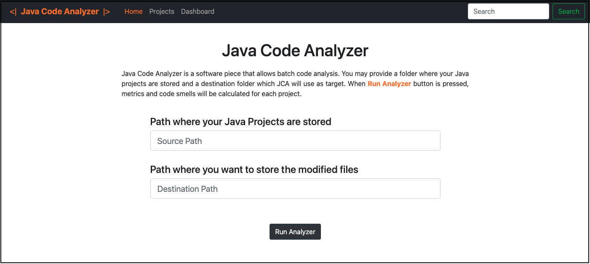
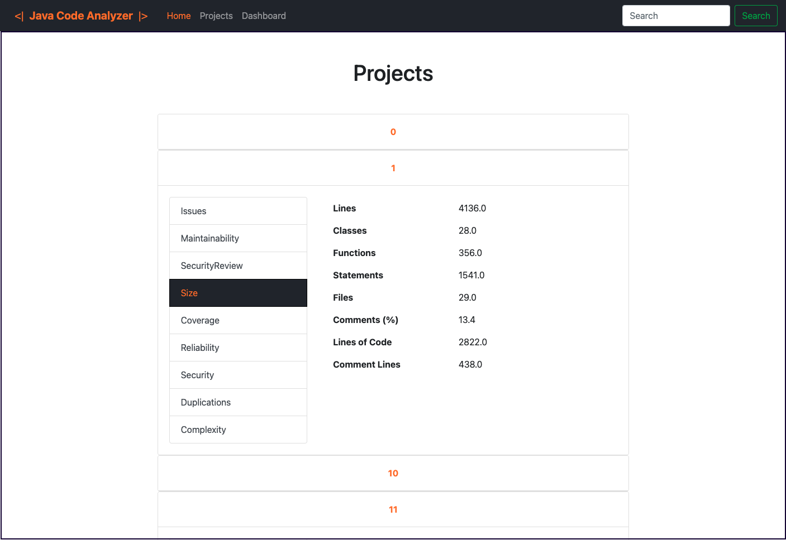
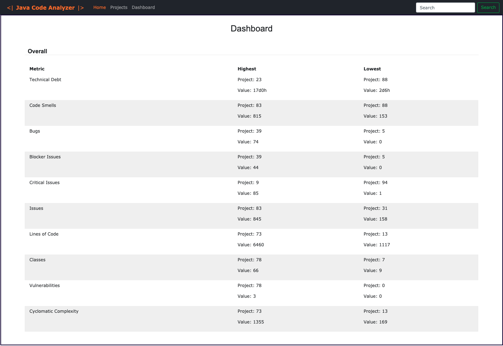
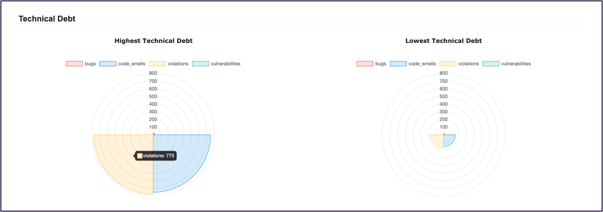
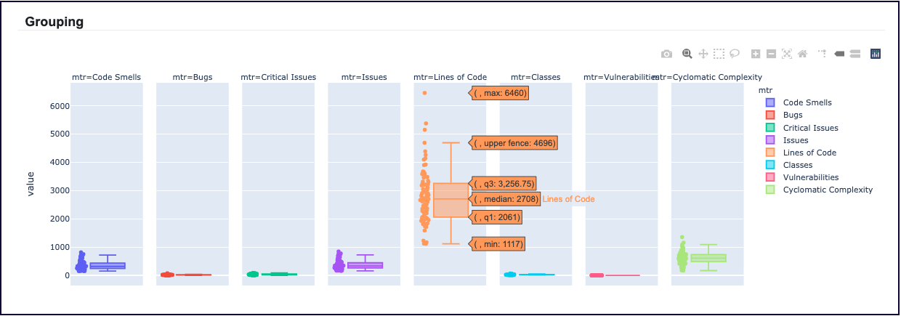

# Java Code Analyser

Aplicação desenvolvida para visualização e análise de métricas de *software*. A aplicação foi desenvolvida usando a *framework* to *python*, *Django*. As métricas são cálculadas pelo do *SonarQube* e a informação é acedida através da *API* do mesmo. De seguida, enumeram-se as suas funcionalidades do sistema:

    - Normalização dos ficheiros dos projectos para ir de encontro com a estrutura de ficheiros do SonarQube
    - Visualização das métricas por projecto. 
    - Visualização de resultados globais sobre um sub-conjunto de métricas.

### Página principal

Nesta página é possível passar o caminho para a pasta onde se encontram os projectos e o caminho da pasta destino onde são guardados os projectos normalizados.

### Projectos
Métricas apresentadas por projectos e pelo seu respectivo domínio. Útil para uma análise detalhada de todas as métricas de um projecto.

### Dashboard
Visualização das métricas de uma forma global. Esta página permite visualizar quais os projectos que tiveram melhor e pior análise sobre um sub-conjunto determinado de métricas.

